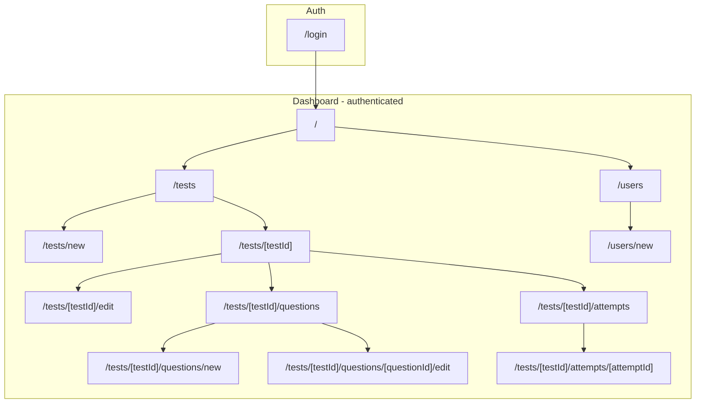

# Admin Dashboard Paths and Pages Plan

## Scope and personas

- **Admin (ADMIN role):** All tests, all attempts for any test, optionally users.
- **Test creator (owner of a test):** Own tests, questions, and attempts for those tests.  

*(Today `GET /api/tests` for non-admin returns only “tests the user has attempted”, not “tests I created”. An API change is needed for creators to see their tests in this app.)*

- **Student:** Test-taking is out of scope here (lives in another app; `POST /api/tests/:testId/attempts/start` requires `STUDENT` and is not used by the dashboard).

---

## Route structure (Next.js App Router)

Use two route groups: `(auth)` for login, `(dashboard)` for authenticated app shell with sidebar/nav.



---

## 1. Auth

| Path | Purpose | API | Notes |

|------|---------|-----|-------|

| `/login` | Email + password; store token, redirect to `/` | `POST /api/auth/login` | `(auth)` layout, minimal (no sidebar). |

Logout: client-only (clear token, redirect to `/login`). No `/logout` route required.

---

## 2. Dashboard shell and home

| Path | Purpose | API | Notes |

|------|---------|-----|-------|

| `/` | Overview: counts (tests, recent attempts), quick links | `GET /api/tests` (for count; admin sees all) | `(dashboard)` layout: sidebar, nav, auth guard. Redirect unauthenticated to `/login`. |

---

## 3. Tests

| Path | Purpose | API | Notes |

|------|---------|-----|-------|

| `/tests` | List tests. Admin: all; creator: needs “created by me” | `GET /api/tests` | **Gap:** Non-admin only gets “tests I attempted”. Need `?createdBy=me` or similar so creators see tests they created. |

| `/tests/new` | Create test form | `POST /api/tests` | Body: `title`, `description`, `pointsPerQuestion`, `timeLimitMinutes`, `isAlwaysAvailable`, `availableFrom`, `availableUntil`. |

| `/tests/[testId] `| Test detail: metadata, availability, time limit, points; links to Questions and Attempts | `GET /api/tests/:testId` | 404 if no access. |

| `/tests/[testId]/edit `| Edit test form | `GET /api/tests/:testId`, `PUT /api/tests/:testId` | Same fields as create. |

---

## 4. Questions (per test)

| Path | Purpose | API | Notes |

|------|---------|-----|-------|

| `/tests/[testId]/questions `| List questions; reorder if supported; link to add/edit | `GET /api/tests/:testId/questions` | Options and `isCorrect` in response. |

| `/tests/[testId]/questions/new `| Create question + options (e.g. 2–6), mark one correct | `POST /api/tests/:testId/questions` | Body: `text`, `options: [{ text, isCorrect, order }]`. |

| `/tests/[testId]/questions/[questionId]/edit `| Edit question and options; delete question | `GET /api/questions/:questionId`, `PUT /api/questions/:questionId`, `DELETE /api/questions/:questionId` | |

---

## 5. Attempts (per test, admin/creator only)

| Path | Purpose | API | Notes |

|------|---------|-----|-------|

| `/tests/[testId]/attempts `| List attempts: student, started, submitted, score | `GET /api/tests/:testId/attempts` | Rows link to `[attemptId]`. |

| `/tests/[testId]/attempts/[attemptId] `| Attempt results: per-question answers, correct/incorrect, points, total and max score | — | **Gap:** `GET /api/attempts/:attemptId/results` requires `attempt.studentId === req.user.id`. Need `GET /api/tests/:testId/attempts/:attemptId/results` (or relax `/attempts/:id/results`) for admin/creator. |

---

## 6. Users (admin only, optional)

| Path | Purpose | API | Notes |

|------|---------|-----|-------|

| `/users` | List users (id, email, role, createdAt) | — | **Gap:** No `GET /api/users`. Add `GET /api/users` + `verifyAdminMiddleware`. |

| `/users/new` | Create user (email, password, role) | — | **Gap:** `POST /api/auth/register` only creates STUDENT. Add `POST /api/users` with `role` + `verifyAdmin`, or extend register. |

If you defer user management, hide “Users” in the nav and omit these routes.

---

## 7. Shared and error routes

| Path | Purpose |

|------|---------|

| `app/not-found.tsx` | 404 page. |

| `app/error.tsx` | Route-level error boundary. |

| `app/global-error.tsx` | Root error boundary. |

| `app/(dashboard)/loading.tsx` | Dashboard loading UI (or per-segment `loading.tsx` where useful). |

---

## File layout under `app/`

```
app/
  (auth)/
    layout.tsx         # Minimal layout for login
    login/
      page.tsx
  (dashboard)/
    layout.tsx         # Sidebar, nav, auth guard
    page.tsx           # /
    loading.tsx
    tests/
      page.tsx         # /tests
      new/
        page.tsx       # /tests/new
      [testId]/
        page.tsx       # /tests/[testId]
        edit/
          page.tsx     # /tests/[testId]/edit
        questions/
          page.tsx     # /tests/[testId]/questions
          new/
            page.tsx   # /tests/[testId]/questions/new
          [questionId]/
            edit/
              page.tsx # /tests/[testId]/questions/[questionId]/edit
        attempts/
          page.tsx     # /tests/[testId]/attempts
          [attemptId]/
            page.tsx   # /tests/[testId]/attempts/[attemptId]
    users/             # Omit if not implementing user management
      page.tsx         # /users
      new/
        page.tsx       # /users/new
  not-found.tsx
  error.tsx
  global-error.tsx
  layout.tsx           # Root (existing)
  globals.css
```

---

## Sidebar / nav (inside `(dashboard)/layout.tsx`)

- **Overview** → `/`
- **Tests** → `/tests`
- **Users** → `/users` (only if implementing; hide for non-admin in any case)

Breadcrumbs or in-page “Back” can be built from the path (e.g. Test → Questions → Edit).

---

## API gaps to implement for the dashboard

1. **Tests for creators:** `GET /api/tests` for non-admin returns only tests-by-attempts. Add `?createdBy=me` (or a separate `GET /api/tests/mine`) so creators see tests they created.
2. **Attempt results for admin/creator:** New `GET /api/tests/:testId/attempts/:attemptId/results` that returns the same shape as `GET /api/attempts/:attemptId/results` but allows access when `user.role === ADMIN` or `test.createdById === user.id`. Reuse `AttemptsService.getAttemptResults` with an override for the student check.
3. **Users (if /users and /users/new are built):**

   - `GET /api/users` (paginated optional), protected by `verifyAdminMiddleware`.
   - `POST /api/users` with `{ email, password, role }`, protected by `verifyAdminMiddleware` (or extend `POST /api/auth/register` with `role` when called by admin).

---

## Suggested implementation order

1. Auth: `(auth)/layout`, `/login`, token storage, and `(dashboard)` auth guard.
2. Dashboard layout: sidebar, nav, `layout.tsx` for `(dashboard)`.
3. `/` and `/tests` (list), `/tests/new`, `/tests/[testId]`, `/tests/[testId]/edit` (and implement API gap #1 if creators will use the app).
4. Questions: `/tests/[testId]/questions`, `.../questions/new`, `.../questions/[questionId]/edit`.
5. Attempts: `/tests/[testId]/attempts`, then `.../attempts/[attemptId]` after API gap #2.
6. `/users` and `/users/new` after API gaps #3 (optional).
7. `not-found`, `error`, `global-error`, and `loading` as in [PRE_PUBLISH_CHECKLIST.md](PRE_PUBLISH_CHECKLIST.md) §6.2.

---

## Data and access summary

- **Test:** `id`, `title`, `description`, `pointsPerQuestion`, `timeLimitMinutes`, `isAlwaysAvailable`, `availableFrom`, `availableUntil`, `createdById`, `createdAt`. Access: admin all; else only if creator.
- **Question:** `id`, `testId`, `text`, `options[]` (`id`, `text`, `isCorrect`, `order`, `explanation`). Access: same as parent test.
- **Attempt (list):** `id`, `testId`, `studentId`, `startedAt`, `submittedAt`, `score`. Access: admin or test creator. For `[attemptId]` results, need new endpoint.
- **User:** `id`, `email`, `role`, `createdAt`. Access: admin only; needs new endpoints.